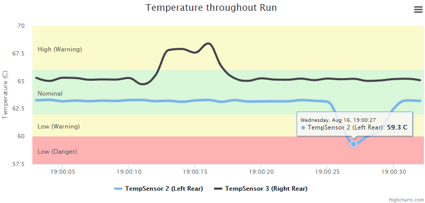
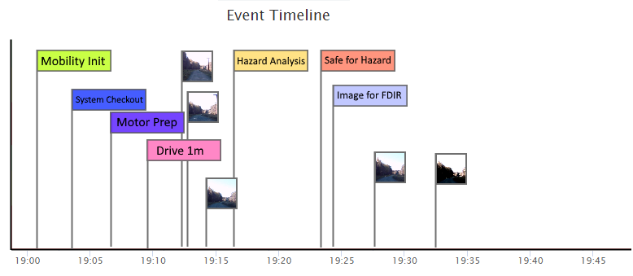
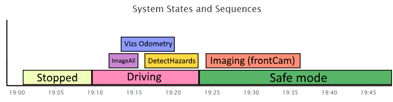
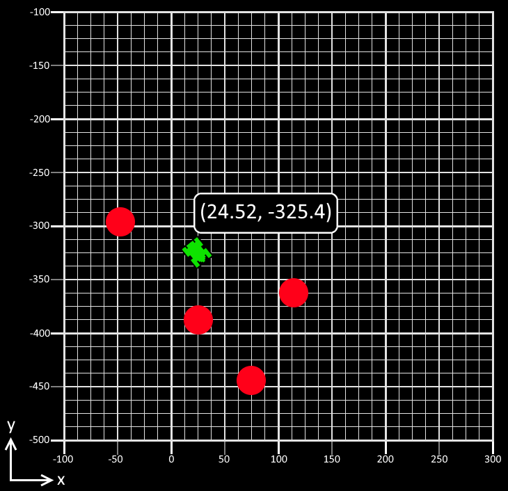
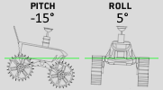
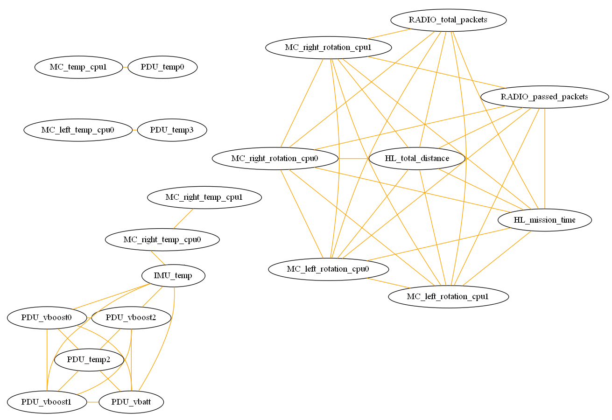
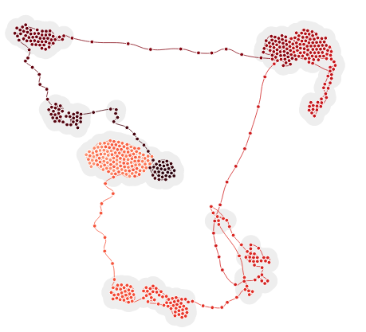

Telemetry Reporter
===================

## Summary

This is a tool to easily build interactive reports for telemetry captured during engineering tests and missions. The tool accepts a number of different types of vehicle/system telemetry, including:

- Timestamped channel values
- Event logs
- State transitions
- Position/orientation updates
- Fault detection thresholds
- Images

When this telemetry data is supplied as input, the Telemetry Reporter tool will generate an interactive set of visualizations which make it possible to easily see the system's changing state over time, and to examine data looking for anomalies. Generated visualizations are customizable and can be uploaded to a server as web content and served out as interactive reports, making them easily sharable with other team members.

## File Structure

Input files must be given specific names in order to be automatically ingested by the Telemetry Reporter tool. A sample file structure, with comments, is below:

```
project
│
│   generate_report.py (Run this script to generate an interactive report)
│
└───input
│   │   events.csv (Timestamped event list)
│   │   channel_data.csv (Timestamped channel values)
│   │   channel_metadata.json (Channel subsystems, units, etc.)
│   │   fault_thresholds.json (Defined safety thresholds for each telemetry channel)
│   │   state_transitions.csv (Timestamped entrance/exits for named states)
│   │
│   └───image_data
│   │   │   image_metadata.csv (Timestamps for each image/video file)
│   │   │   mainCam001.png (Single image data product--filename is arbitrary)
│   │   │   mainCam002.png
│   │   │   sideCamL000.png
│   │   │   sideCamR00.mp4
│   │   │   sideCamF00.mp4
│   │   └   ...
│   │
│   └───poses
│   │   │   main_poses.csv (Timestamped positions/orientations for object)
│   │   |   static_objects.json (Positions/orientations/models to use for objects that never move)
│   │   |   axes.json (Data for axis alignment)
|   |   |   main_model.obj (3D model of main vehicle/system for rendering position/orientation over time)
|   |   |   model_001.obj (3D model for object that never moves--filename is arbitrary)
|   |   |   model_002.obj
│   │   └   ...
│   │
│   └───customization
│       │   logo.png (Team/project logo)
│       │   customization_metadata.json (Name of team, name of test, color scheme, visualization options, etc.)
|       └   ...
|
└───output (Contains generated report after running generate_report.py)
    │   index.html (Main page of report)
    │
    └───content (Content needed to display report)
```

## Report Components

### 2D Time Series Plots

Channel telemetry listed in **channel_data.csv** can be visualized as line plots, with MATLAB's ```plot()``` command. Multiple channels can be selected and plotted on the same visualization, with the ability to scale axes and to scrub through the entirety of recorded telemetry. Channels can be filtered manually or by subsystem (if configured in **channel_metadata.json**). Channel fault thresholds can be shown if configured in **fault_thresholds.json**.



### Mission Timeline Showing Events, State Transitions and Image Acquisitions

A full timeline of the mission can be shown, visualizing all of the events listed in **events.csv**, and showing running states transitions and/or sequence execution (listed in **state_transitions.csv**) as a [Gantt chart](https://en.wikipedia.org/wiki/Gantt_chart). Images and videos are also shown at the times they were acquired (as defined in **image_metadata.csv**).





### Position Visualization (2D)

The 2D position of the vehicle or system (defined in **main_poses.csv**) is shown over time. As the user scrubs through the Mission Timeline, the vehicle moves through the visualization accordingly. Static objects (ones that maintain the same position/orientation throughout the time period) can be defined in **static_objects.json**, and models can be assigned to them as well. Axes are configurable in **axes.json**.



### Position Visualization (3D)

3D position and attitude of the vehicle or system over time can also be shown, based on data from **main_poses.csv**, with similar Mission Timeline integration as the 2D visualization.


### Attitude Visualization (3D)

The attitude (a.k.a. orientation) of the vehicle or system (defined in **main_poses.csv**) is shown over time. As the user scrubs through the Mission Timeline, the vehicle reorients accordingly. Euler angles are also shown. A 3D model can be supplied in **main_model.obj**.



### State Diagram

A visual summary showing state transitions over time can be shown, based on the data supplied in **state_transitions.csv**.


### Correlative Analysis (Experimental)

The telemetry channel data in **channel_data.csv** can be processed to render a visual summary of changing correlative state over time. An *undirected dependency graph* shows subgroups of highly correlated telemetry channels, indicating possible semantic connections between types of data.



A *time curve plot* visualizes correlative state as a 2D embedding, allowing an operator to see sudden changes in intercorrelation between telemetry channels as movements in 2D space.



See [this paper](readmeContent/nathaniel_guy_masters_thesis.pdf) for a detailed description of the analytic techniques used.
